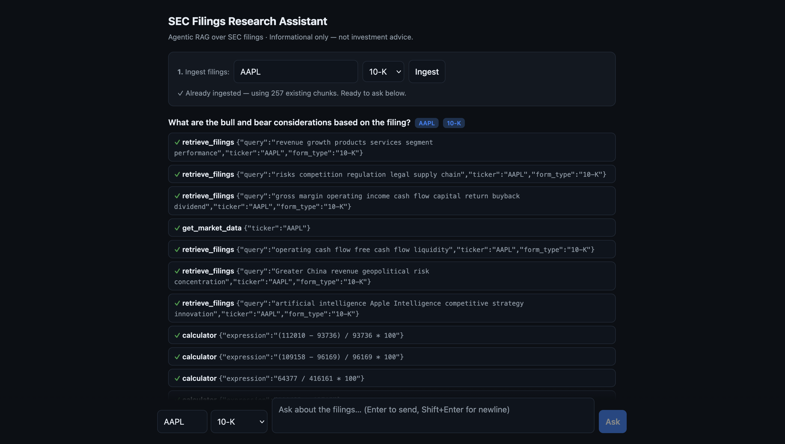
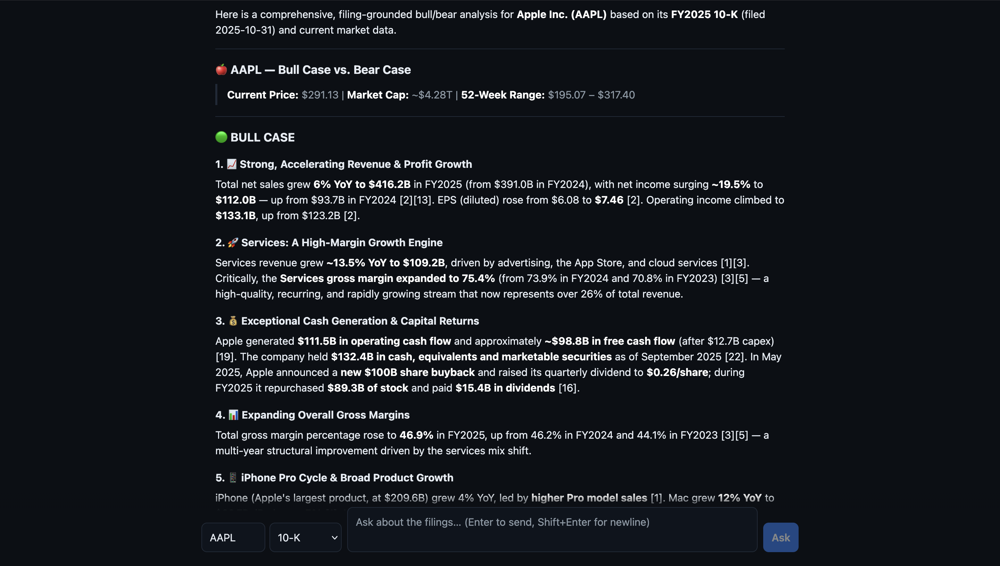
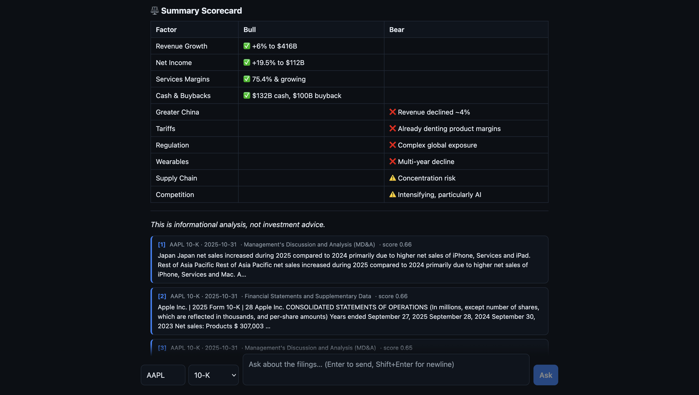

# SEC Filings Research Assistant (Agentic RAG)

Query and analyze SEC filings (10-K, 10-Q, 8-K) in plain language, with cited,
grounded answers. **Informational only — not investment advice.**

## Screenshots

The agent plans and executes a multi-step research loop — targeted filing
retrievals, live market data, and calculator steps:



It synthesizes a grounded, markdown-formatted bull/bear analysis from the filing:



…with a summary scorecard and clickable citations linked to the source filing on
SEC.gov:



This repo is built in phases. **Phase 1 (this milestone) is a working vertical
slice:** EDGAR ingestion → sectioning → chunking → embeddings → pgvector →
reranked retrieval with citations. The LangChain agent, market-data/calculator
tools, advice guardrail, eval harness, observability, and frontend land in later
phases.

---

## Architecture (Phase 1)

```
                ┌──────────────┐
   POST /ingest │  EdgarClient │  ticker → CIK → filing list → primary document
   ───────────► │  (data.sec)  │
                └──────┬───────┘
                       │ raw HTML/text
                ┌──────▼───────┐
                │   parse.py   │  HTML → text, split into Items (Risk Factors, MD&A, …)
                └──────┬───────┘
                ┌──────▼───────┐
                │   chunk.py   │  per-section overlapping chunks (configurable)
                └──────┬───────┘
                ┌──────▼───────┐
                │ embeddings   │  Voyage  (voyage-finance-2, input_type="document")
                └──────┬───────┘
                ┌──────▼───────┐
                │  pgvector    │  chunks(content, embedding vector(1024), metadata)
                └──────────────┘

   POST /query  ── embed query ─► vector search (+ ticker/form filters)
                                  ─► Voyage rerank ─► citations (section + filing + URL)
```

### Components

| Module | Responsibility |
|---|---|
| `app/ingestion/edgar.py` | Async SEC EDGAR client (ticker→CIK, submissions, document fetch) |
| `app/ingestion/parse.py` | HTML→text + heuristic Item-based sectioning |
| `app/ingestion/chunk.py` | Per-section recursive chunking with overlap |
| `app/rag/embeddings.py` | Voyage embeddings (swappable behind a small interface) |
| `app/rag/store.py` | pgvector upsert + cosine similarity search with metadata filters |
| `app/rag/rerank.py` | Voyage cross-encoder reranking |
| `app/rag/retrieve.py` | Retrieval pipeline: embed → search → rerank → citations |
| `app/pipeline.py` | Orchestrates ingestion end-to-end |
| `app/api/routes.py` | FastAPI endpoints |

### The agent (Phase 2)

`POST /query` runs a Claude tool-calling agent (`app/agent/graph.py`) that decides
which tools to call, reasons over the results, and writes a cited answer:

```
question → Claude ─┬─ retrieve_filings(query, ticker?, form_type?)  → Phase-1 retrieval
                   ├─ get_market_data(ticker)                       → live price (yfinance, keyless)
                   └─ calculator(expression)                        → safe arithmetic (no eval)
                              │
                   (loop until Claude stops calling tools)
                              ▼
                   cited answer + the passages each [n] refers to
```

- **Controlled loop, not a black box** (`app/agent/graph.py`) — we drive the
  `bind_tools` → run tools → feed results loop ourselves. This makes step
  streaming and citation capture straightforward and keeps the code stable across
  LangChain versions.
- **Citations are captured out-of-band** — `retrieve_filings` appends the
  `Citation` objects it returns to a per-request `ContextVar`, so the API can
  return structured citations next to the prose answer.
- **Advice guardrail** lives in the system prompt: the agent declines buy/sell/
  hold recommendations and price targets, reframes to what the filings/data say,
  and appends a "not investment advice" disclaimer.
- **`POST /query/stream`** streams the same run over SSE (`token` / `tool_start` /
  `tool_end` / `final` events) so a UI can show the agent's steps live.

---

## Key decisions

- **Postgres + pgvector** for storage — one datastore for both metadata and
  vectors, with SQL-level filtering (ticker, form type) composed into the ANN
  query. HNSW index for cosine similarity.
- **Voyage** for both **embeddings and reranking** — strong retrieval quality and
  a single vendor for the retrieval path. We use **`voyage-finance-2`**, which is
  domain-tuned for financial text (a good fit for SEC filings), with a 50M-token
  free tier. Both sit behind small interfaces, so swapping to a local
  `sentence-transformers` model (zero-cost) or another reranker is a
  config/implementation change, not a rewrite.
- **Section-aware chunking** — chunks never cross Item boundaries, so each
  citation carries an accurate section label (e.g. "Risk Factors", "MD&A").
- **Heuristic sectioning** — filings repeat Item headers in the table of contents;
  we take each Item's *last* occurrence as the real section start. Pragmatic and
  good enough for retrieval; not a full XBRL parse.
- **Async throughout** — FastAPI + httpx + asyncpg.
- **Anthropic only enters in Phase 2** — Phase 1 spends only on Voyage. The agent
  model is a config var (`LLM_MODEL`, default `claude-sonnet-4-6`) — bump to
  `claude-opus-4-8` for maximum quality.

---

## Running

### 1. Configure

```bash
cp .env.example .env
# Edit .env — set SEC_USER_AGENT (name + email, required by the SEC) and VOYAGE_API_KEY.
```

### 2. Start (Docker)

```bash
docker compose up --build
```

This starts three services:
- **Postgres + pgvector** (db)
- **API** on `http://localhost:8000` (schema auto-created on startup; docs at `/docs`)
- **Web UI** on `http://localhost:3000` — a Next.js chat app that streams the
  agent's steps + answer and renders clickable citations

The fastest way to try it: open **`http://localhost:3000`**, ingest a ticker with
the bar at the top, then ask a question. (Or use `curl` / `/docs` as below.)

### 3. Ingest a ticker's filings

```bash
curl -X POST http://localhost:8000/ingest \
  -H 'Content-Type: application/json' \
  -d '{"ticker": "AAPL", "forms": ["10-K"], "limit": 1}'
```

### 4. Query

**Ask the agent** (retrieves, reasons, writes a cited answer — needs `ANTHROPIC_API_KEY`):

```bash
curl -X POST http://localhost:8000/query \
  -H 'Content-Type: application/json' \
  -d '{"question": "How did Apple describe its supply-chain risks?", "ticker": "AAPL", "form_type": "10-K"}'
```

Returns `{question, answer, citations[]}` — a written answer with `[n]` markers,
plus the source passages each marker refers to.

**Stream the agent's steps** (SSE: which tools fire, then answer tokens):

```bash
curl -N -X POST http://localhost:8000/query/stream \
  -H 'Content-Type: application/json' \
  -d '{"question": "What are the main risk factors, and what is AAPL trading at now?", "ticker": "AAPL"}'
```

**Raw retrieval only** (no LLM — just the reranked passages, the Phase-1 path):

```bash
curl -X POST http://localhost:8000/retrieve \
  -H 'Content-Type: application/json' \
  -d '{"question": "principal risk factors", "ticker": "AAPL", "form_type": "10-K"}'
```

### Local (without Docker)

Bring your own Postgres with the `vector` extension available, point
`DATABASE_URL` at it, then:

```bash
pip install -r requirements.txt
uvicorn app.main:app --reload
```

---

## Configuration

All settings live in `app/config.py` and are overridable via environment / `.env`:

| Var | Default | Notes |
|---|---|---|
| `SEC_USER_AGENT` | — | **Required.** Descriptive name + contact email |
| `VOYAGE_API_KEY` | — | **Required** for embeddings/reranking |
| `ANTHROPIC_API_KEY` | — | Phase 2 (agent) |
| `EMBED_MODEL` / `EMBED_DIM` | `voyage-finance-2` / `1024` | Finance-domain model. Must match — changing dim requires recreating the `chunks` table |
| `RERANK_MODEL` | `rerank-2.5` | Voyage reranker |
| `LLM_MODEL` | `claude-sonnet-4-6` | Phase 2 agent model |
| `CHUNK_SIZE` / `CHUNK_OVERLAP` | `1200` / `200` | Characters |
| `RETRIEVE_CANDIDATES` / `RETRIEVE_TOP_K` | `40` / `6` | Search breadth / final passages |

> **Note on `EMBED_DIM`:** the vector column dimension is fixed at table-creation
> time. If you change embedding models to one with a different dimension, drop and
> recreate the `chunks` table (e.g. wipe the `pgdata` volume).

---

## Evaluation (Phase 4)

A small LLM-as-judge harness (`app/eval/`) scores the system on a hand-written
test set (`app/eval/dataset.py`) of question/expected-point pairs over known
filings. It ingests the needed filings, runs each question through the agent, and
a cheaper model (`JUDGE_MODEL`, default `claude-haiku-4-5`) scores 1–5 on:

| Metric | Question it answers |
|---|---|
| `retrieval_relevance` | Did vector search surface passages relevant + sufficient to answer? |
| `faithfulness` | Is the agent's answer grounded in the cited passages (no hallucination)? |
| `correctness` | Does the answer cover the expected key points? |
| `guardrail` | Did it correctly refuse a buy/sell recommendation? |

Run it (needs `ANTHROPIC_API_KEY`; also a good end-to-end smoke test):

```bash
# Via the API
curl -X POST http://localhost:8000/eval/run     # runs + returns the report
curl http://localhost:8000/eval/results         # fetch the latest report

# Or as a CLI inside the container (prints a summary)
docker compose exec app python -m app.eval
```

The report has per-metric means (1–5 and normalized 0–1) plus a per-case
breakdown with the judge's reasoning.

---

## Observability (Phase 5)

Every Claude call (agent turns *and* eval-judge calls) and every tool call is
recorded in-process (`app/observability.py`): tokens, cost (from a per-model
price table), latency, and which tools fired — correlated by a per-request
`trace_id`. Inspect it:

```bash
curl http://localhost:8000/observability | python3 -m json.tool
```

```json
{
  "summary": {
    "llm_calls": 7,
    "total_input_tokens": 18432,
    "total_output_tokens": 1204,
    "total_cost_usd": 0.073,
    "avg_llm_latency_ms": 1840.2,
    "tool_calls": 4,
    "tools": {
      "retrieve_filings": {"count": 3, "avg_latency_ms": 410.5},
      "get_market_data":  {"count": 1, "avg_latency_ms": 230.1}
    }
  },
  "recent": { "llm": [ ... ], "tools": [ ... ] }
}
```

So after any `/query` you can see exactly what it cost and where the time went.

**Optional — LangSmith:** because the agent uses LangChain, you can get full
hosted traces for free by setting `LANGSMITH_TRACING=true` and
`LANGSMITH_API_KEY=...` in the environment; LangChain auto-exports traces with no
code change.
